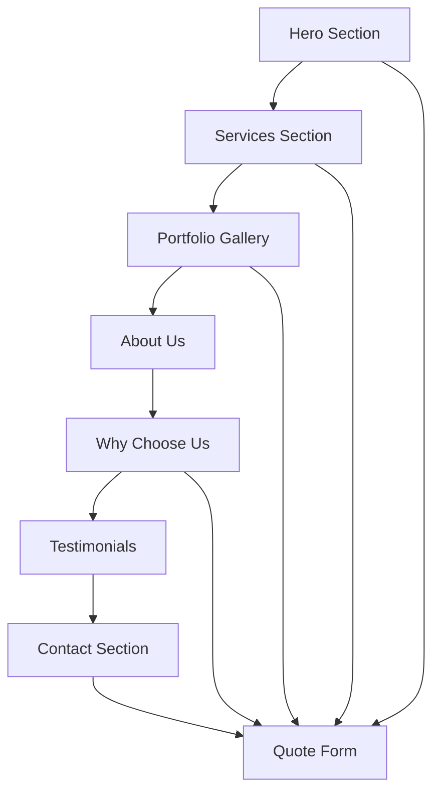

# Humble Plumbing and Gasfitting Website - Product Requirements Document

## 1. Product Overview

A professional single-page website for Humble Plumbing and Gasfitting that showcases comprehensive plumbing and gas fitting services while driving customer conversions through strategic design and user experience optimization.

The website serves as the primary digital presence for attracting residential and commercial clients, establishing trust through professional presentation, and converting visitors into customers through prominent quote forms and clear service offerings. The platform targets homeowners, property managers, and commercial clients seeking reliable plumbing and gas fitting services.

## 2. Core Features

### 2.1 User Roles

| Role | Registration Method | Core Permissions |
|------|---------------------|------------------|
| Website Visitor | No registration required | Can browse all content, submit quote forms, view services and portfolio |
| Potential Customer | Contact form submission | Can request quotes, view detailed service information, access contact details |

### 2.2 Feature Module

Our website requirements consist of the following main sections:

1. **Hero Section**: Company branding, primary value proposition, prominent "Get a Quote" form, emergency contact number
2. **Services Section**: Comprehensive service listings with detailed descriptions, residential and commercial offerings
3. **Portfolio Gallery**: Professional project showcase with before/after images, service category filtering
4. **About Us Section**: Company profile, team information, certifications, and trust badges
5. **Why Choose Us**: Unique value propositions, competitive advantages, customer benefits
6. **Testimonials Section**: Customer reviews, ratings, and success stories
7. **Contact Section**: Multiple contact methods, service area information, business hours

### 2.3 Page Details

| Page Name | Module Name | Feature description |
|-----------|-------------|---------------------|
| Single Page Website | Hero Section | Display company logo, tagline, emergency phone number with one-tap calling, prominent "Get a Quote" form with fields for name, phone, email, service type, and message |
| Single Page Website | Navigation Bar | Fixed navigation with smooth scroll to sections: Services, Portfolio, About, Why Choose Us, Testimonials, Contact |
| Single Page Website | Services Section | Comprehensive service listings including residential plumbing, commercial plumbing, gas fitting, hot water systems, renovations, drain cleaning, leak detection, pipe repairs, gas appliance installation, safety inspections, water filtration, backflow prevention |
| Single Page Website | Portfolio Gallery | Professional image gallery with project categories, before/after comparisons, service type filtering, lightbox image viewing |
| Single Page Website | About Us Section | Company history, team profiles, certifications display, Master Plumbers badge, licensing information, years of experience highlight |
| Single Page Website | Why Choose Us | Key differentiators including 24/7 emergency service, licensed professionals, insurance coverage, quality guarantee, competitive pricing, local expertise |
| Single Page Website | Testimonials Section | Customer review carousel, star ratings, customer names and service types, Google Reviews integration display |
| Single Page Website | Contact Section | Business address, phone numbers, email, service areas, business hours, emergency contact information, social media links |
| Single Page Website | Quote Form | Multiple strategically placed quote request forms with Basin integration, fields for contact details, service selection, urgency level, preferred contact method |

## 3. Core Process

**Primary User Flow:**
Visitors land on the hero section, immediately see the company's value proposition and emergency contact number. They can either call directly for urgent needs or scroll through services to understand offerings. The portfolio section builds trust through visual proof of work quality. The "Why Choose Us" section reinforces competitive advantages, while testimonials provide social proof. Multiple quote forms throughout the journey capture leads at various engagement levels.

**Quote Request Flow:**
Users can access quote forms from the hero section, after viewing services, or from the contact section. Forms collect essential information and submit via Basin service, triggering email notifications to the business for immediate follow-up.

## 4. User Interface Design

### 4.1 Design Style

- **Primary Colors**: Deep blue (#1e3a8a) and orange (#f97316) derived from company logo
- **Secondary Colors**: Light gray (#f8fafc), dark gray (#374151), white (#ffffff)
- **Button Style**: Rounded corners with gradient effects, prominent orange CTAs, subtle shadows
- **Typography**: Professional sans-serif fonts - Roboto for headings, Open Sans for body text
- **Layout Style**: Clean, modern design with card-based service sections, full-width hero, grid-based portfolio
- **Icons**: Professional plumbing and gas fitting icons, trust badges, certification logos

### 4.2 Page Design Overview

| Page Name | Module Name | UI Elements |
|-----------|-------------|-------------|
| Single Page Website | Hero Section | Full-width background with company vehicle image, centered logo, bold headline, orange "Get Quote" button, emergency phone number in header |
| Single Page Website | Navigation | Fixed top navigation with company logo, smooth scroll menu items, mobile hamburger menu, orange accent colors |
| Single Page Website | Services Section | Grid layout with service cards, icons for each service, hover effects, "Learn More" buttons linking to quote forms |
| Single Page Website | Portfolio Gallery | Masonry grid layout, category filter buttons, lightbox overlay, before/after image comparisons |
| Single Page Website | About Section | Two-column layout with team photo, certification badges, trust indicators, professional headshots |
| Single Page Website | Why Choose Us | Icon-based feature blocks, numbered benefits, contrasting background section |
| Single Page Website | Testimonials | Carousel slider with customer photos, star ratings, quote styling, navigation dots |
| Single Page Website | Contact Section | Split layout with contact form and business information, embedded map, social media icons |

### 4.3 Responsiveness

Desktop-first design with mobile-adaptive breakpoints. Touch-optimized interactions for mobile devices including one-tap phone calling, easy form completion, and swipe-friendly gallery navigation. Responsive typography scaling and flexible grid layouts ensure optimal viewing across all device sizes.