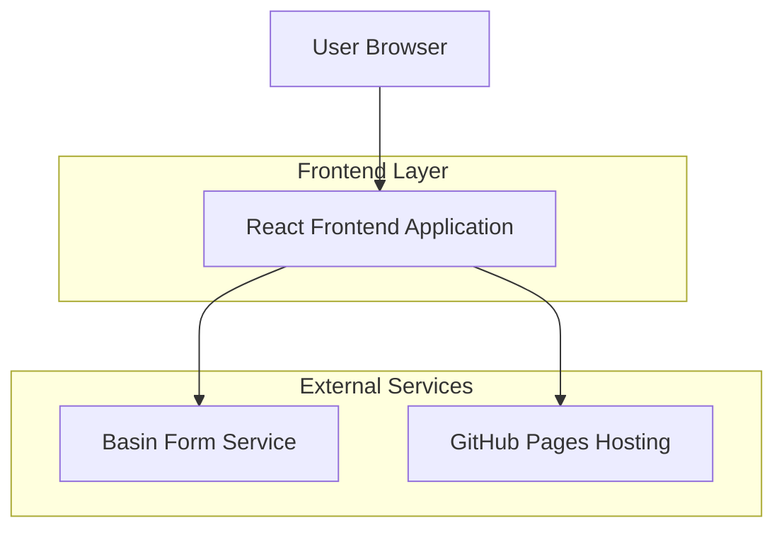

# Humble Plumbing and Gasfitting Website - Technical Architecture Document

## 1. Architecture Design



## 2. Technology Description

- Frontend: React@18 + TailwindCSS@3 + Vite
- Form Handling: Basin (external service)
- Hosting: GitHub Pages
- Build Tool: Vite for optimized production builds
- Styling: TailwindCSS for responsive design and utility classes

## 3. Route Definitions

| Route | Purpose |
|-------|---------|
| / | Single-page application with all sections (Hero, Services, Portfolio, About, Why Choose Us, Testimonials, Contact) |

## 4. API Definitions

### 4.1 Core API

Quote Form Submission (Basin Integration)
```
POST https://usebasin.com/f/{FORM_ID}
```

Request:
| Param Name | Param Type | isRequired | Description |
|------------|------------|------------|-------------|
| name | string | true | Customer's full name |
| phone | string | true | Contact phone number |
| email | string | true | Customer's email address |
| service | string | true | Type of service requested |
| message | string | false | Additional details or specific requirements |
| urgency | string | false | Service urgency level (emergency, urgent, standard) |

Response:
| Param Name | Param Type | Description |
|------------|------------|-------------|
| success | boolean | Form submission status |

Example Request:
```json
{
  "name": "John Smith",
  "phone": "+64 21 123 4567",
  "email": "john.smith@email.com",
  "service": "Emergency Plumbing",
  "message": "Burst pipe in kitchen, need immediate assistance",
  "urgency": "emergency"
}
```

## 5. Server Architecture Diagram

Not applicable - Static site deployment with no backend services.

## 6. Data Model

### 6.1 Data Model Definition

No database required. All content is static and managed through React components and configuration files.

### 6.2 Data Definition Language

Not applicable - Frontend-only application with no database requirements. All data is managed through:

- Static content in React components
- Configuration files for services, testimonials, and portfolio items
- Form submissions handled by Basin external service
- Images and assets served from GitHub Pages static hosting

**Static Data Structure Examples:**

Services Configuration:
```javascript
const services = [
  {
    id: 1,
    title: "Residential Plumbing",
    description: "Complete plumbing solutions for homes",
    icon: "home",
    category: "residential"
  },
  {
    id: 2,
    title: "Gas Fitting",
    description: "LPG and natural gas installations",
    icon: "gas",
    category: "gas"
  }
];
```

Portfolio Items:
```javascript
const portfolioItems = [
  {
    id: 1,
    title: "Kitchen Renovation",
    category: "renovation",
    beforeImage: "/images/kitchen-before.jpg",
    afterImage: "/images/kitchen-after.jpg",
    description: "Complete kitchen plumbing upgrade"
  }
];
```

Testimonials:
```javascript
const testimonials = [
  {
    id: 1,
    name: "Sarah Johnson",
    rating: 5,
    comment: "Excellent service and professional work",
    service: "Bathroom Renovation",
    date: "2024-01-15"
  }
];
```